### 14 aug
Hindus should not harbour anger against Muslims even if the latter want to destroy and kill us all. We should face death bravely. If the Muslims established their rule after killing all Hindus we would be ushering in a new India. - Mahatma Gandhi

#PartitionHorrorsRemembranceDay

---

Nehru: I hate the mention of the word profit. Never talk to me about Profit. It is a dirty word.

JRD Tata: Nehru was an ignoramus in economic matters and insisted on this business of socialism. If Patel had become the Prime minister, India would have followed a different path.

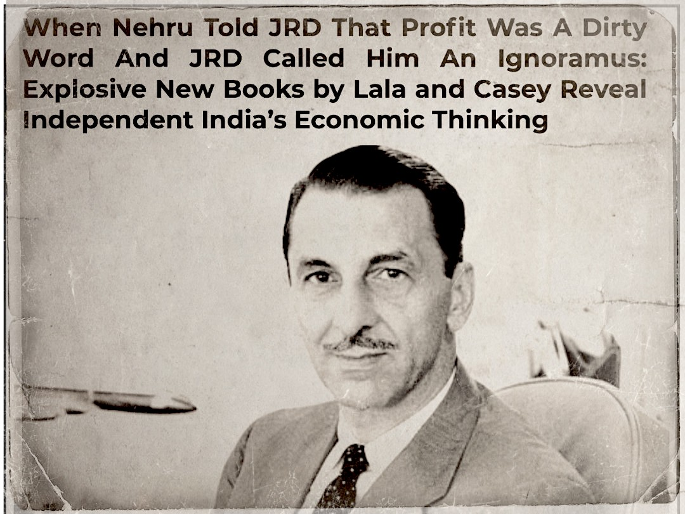

---

Nothing wrong with having the Union Jack in a corner of our flag. We must take note of virtues of the British - MK Gandhi

The virtuous British killed 35 million Indians, manufactured 12 famines, drove our life expectancy to a mere 32 years, looted $ 45 trillion, broke us in two.

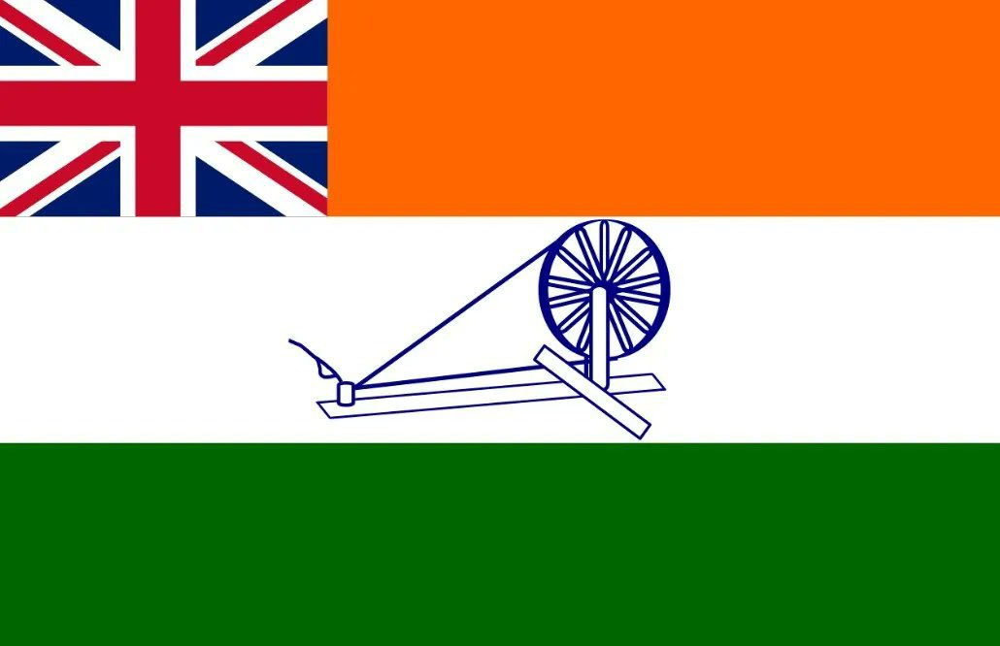

---
jun 16 2024

10 years ago Peta held a rally in India asking Muslims to turn Vegan at Eid. Their activists were thrashed so badly they might have been lynched had cops not intervened. Peta never held a rally on Eid ever again.

All the sermonising is reserved exclusively for Hindu festivals.

<table>
<tr>
<td>

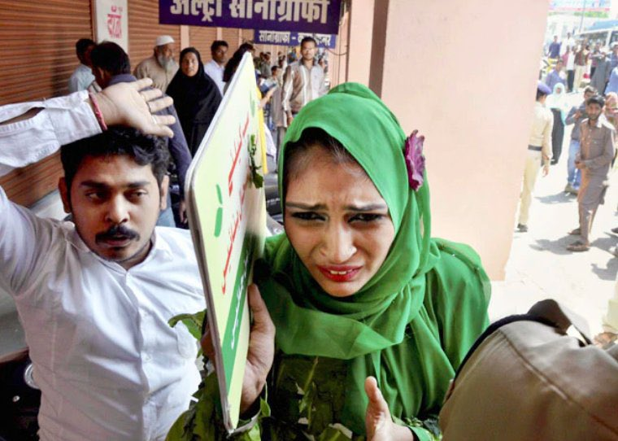
</td>
<td>

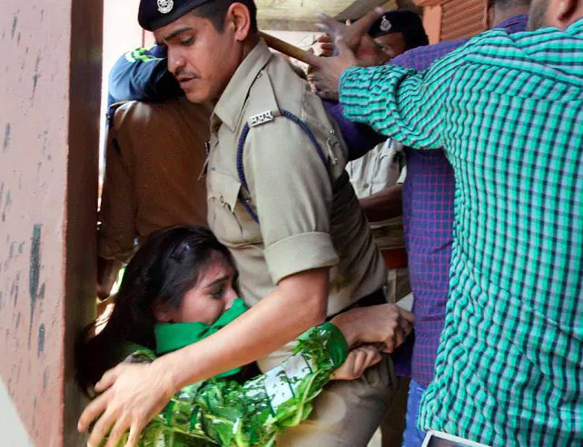
</td>
</tr>
<table>

---

Freedom of Speech and Expression under Jawaharlal Nehru.
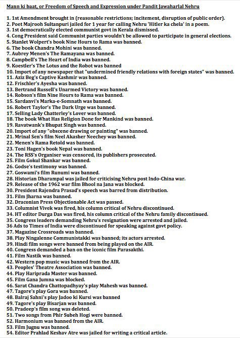

---

So safe and secure was Democracy under the Congress that, when CEC Gopalaswami demanded that the President remove EC Navin Chawla, the President - who used to cook for Indira Gandhi - not only refused to act, she made Chawla the CEC, just in time to oversee the 2009 elections.

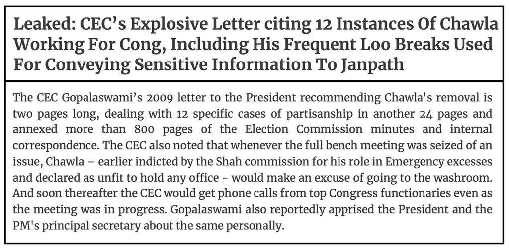

---

Congress comprehensively rigged the 1987 Jammu & Kashmir elections through ballot stuffing, arrests, curfews, even declaring defeated candidates as winners. Here is Shashi Tharoor himself admitting to the rigging.

These are the same people who accuse others of killing Democracy.

[👉 click here for video 👈](https://x.com/ARanganathan72/status/1792942733600117096) 

---

During the Congress regime, I was summoned by a top Doordarshan official and told that my kalawa [sacred Hindu thread] must not be visible on the screen. I refused to remove my kalawa. It is my identity; it is a matter of pride for me. - 
@AshokShrivasta6
, Anchor and Journalist

[👉 click here for video 👈](https://x.com/ARanganathan72/status/1790347901434257466) 

---

Tamil Nadu police tracked a Youtuber all the way to Noida and arrested him. They are now taking him back by train. His crime? He interviewed a man who apparently said something that someone found objectionable.

Nothing to worry. Democracy is alive and kicking in Tamil Nadu.

(freedom of speech)

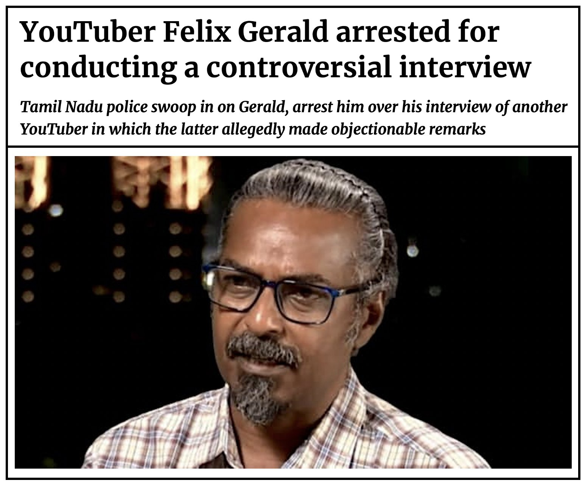

---

Just a fraction of the sporting events and stadia named after Nehru, Indira, and Rajiv Gandhi, without doubt the greatest sporting dynasty the world has ever seen.

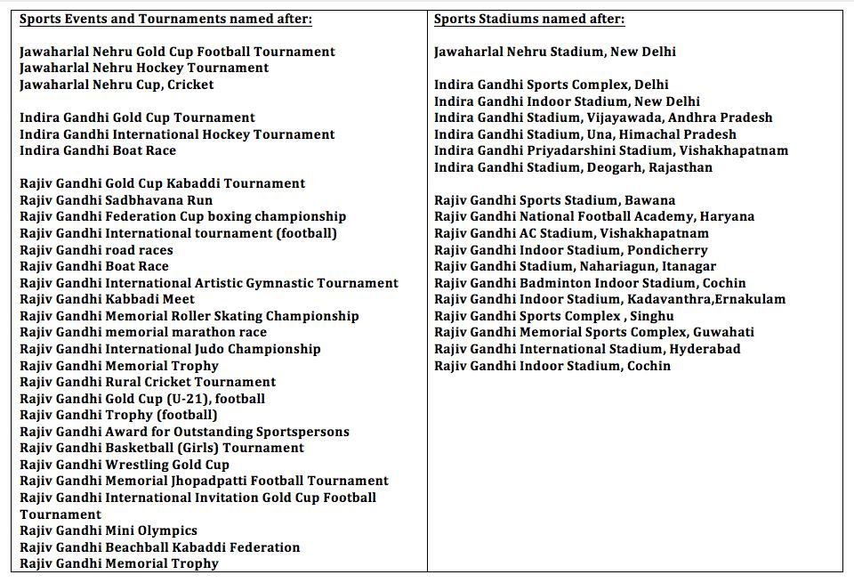
 
***

Every last one of these metric pass fraudsters lamenting the death of science when a beam of light consecrated Ram lalla were celebrating the birth of saint when a beam of light cured cancer.

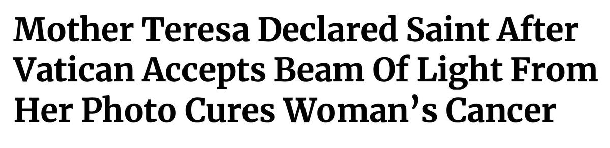

***

Names of places to visit in Raebareli and Amethi.

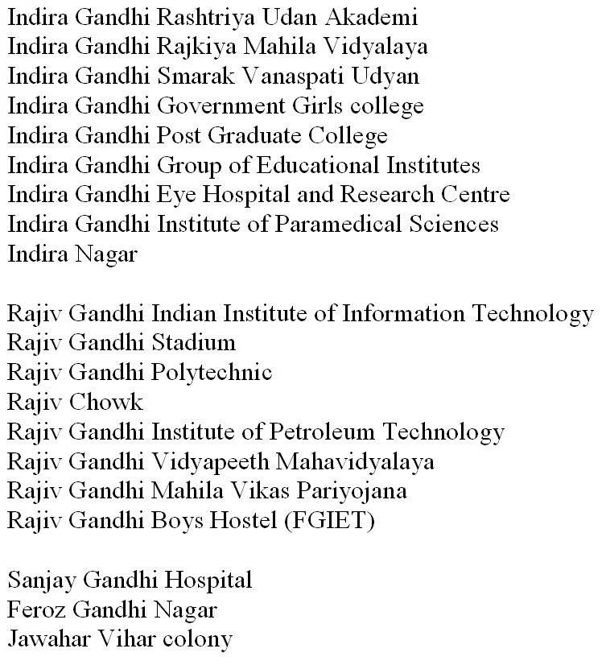

***

Suggestions have been made by the United States that India should take China's place in the Security Council. We cannot of course accept this as it means falling out with China and it would be very unfair for a great country like China not to be in the Security Council. - Nehru

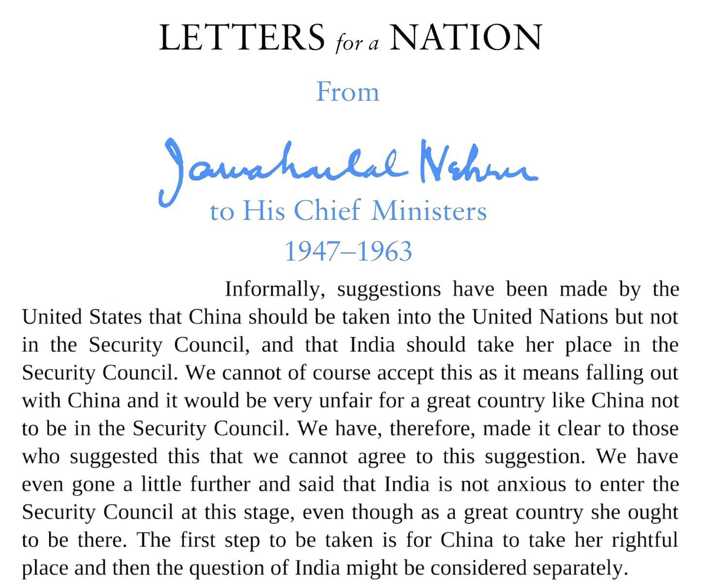

***

dec 15 2023

Today is Sardar Patel’s punyatithi.

Never forget, that Jawaharlal Nehru not only issued directives to his ministers to not attend Sardar Patel’s funeral he also asked President Rajendra Prasad to miss it. Thankfully the President as well as many ministers ignored Nehru’s advice.

<table>
<tr>
<td rowspan="2" >

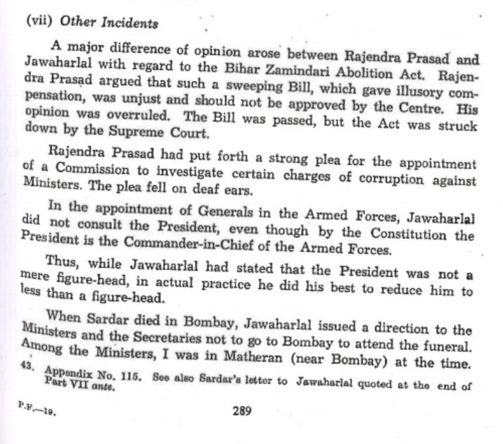
</td>
<td>

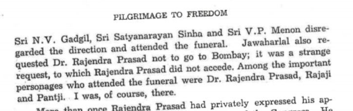
</td>

</tr>
<tr>
<td>

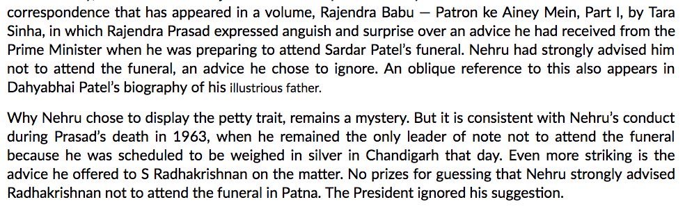
</td>
</tr>
</table>

    